<h1 align="center">
    
</h1>

<h3 align="center"> Curso para Treinamento - Udemy Desenvolvedor Multiplataforma Android/IOS com React e Redux. </h3>

<h5 align="center"> Criada com a stack  React Native e  Conceitos básicos de JavaScript </h5>

---

Crie Apps Nativos para Android e IOS utilizando JavaScript ES6, React, React Native, Redux e Firebase.

[Link do Curso](https://www.udemy.com/) Desenvolvedor Multiplataforma Android/IOS com React e Redux  Udemy.

# Conteúdo

## APP1 Geração de números randômicos:

Aqui você será introduzido ao universo React Native, aprenderá sobre a sintaxe JSX e será apresentado as features arrow functions e destructuring assignment do Ecmascript 2015 (ES6).

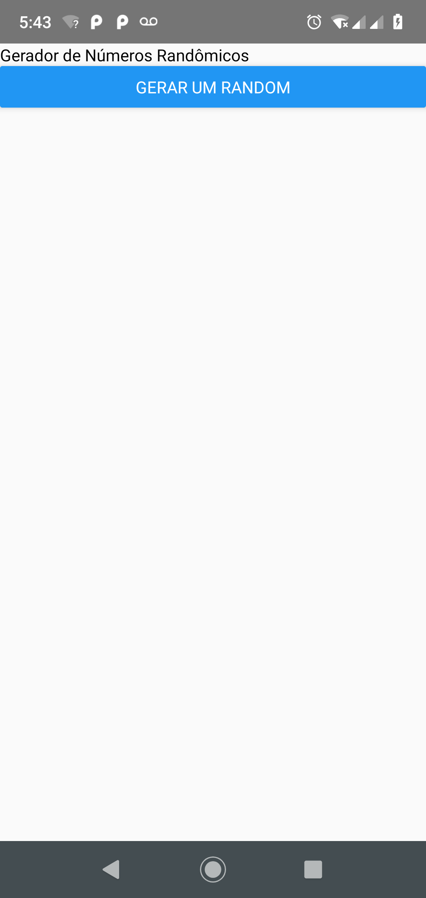
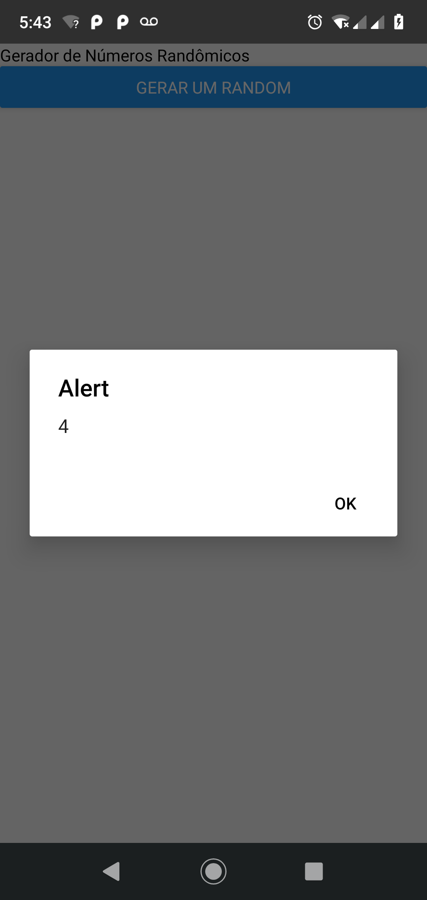

## APP2 Frases do dia:

Nesse App você aprenderá a produzir visuais fantásticos utilizando o flexbox.

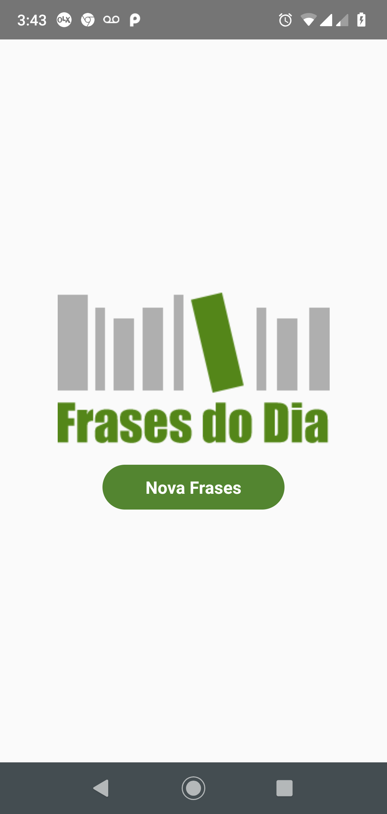
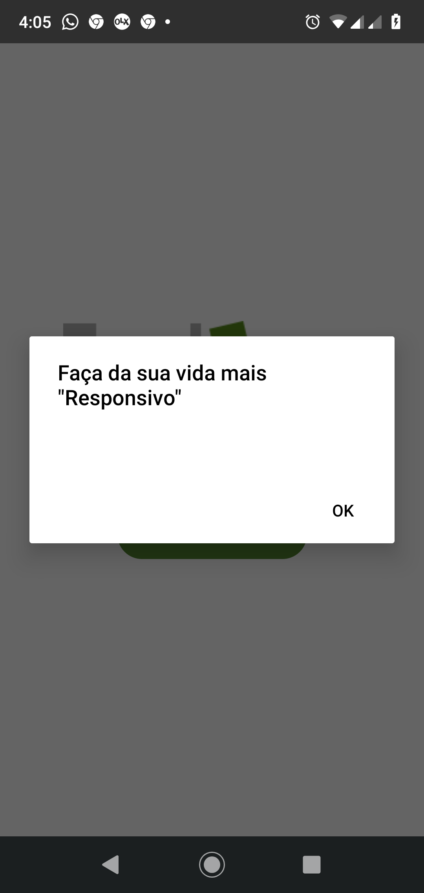

## APP3 Game Jokenpô:

Nesse App você aprenderá conceitos muito importantes sobre o controle de estado dos componentes do React (props e states) e também será introduzido ao conceito de modularização para o reaproveitamento de código.

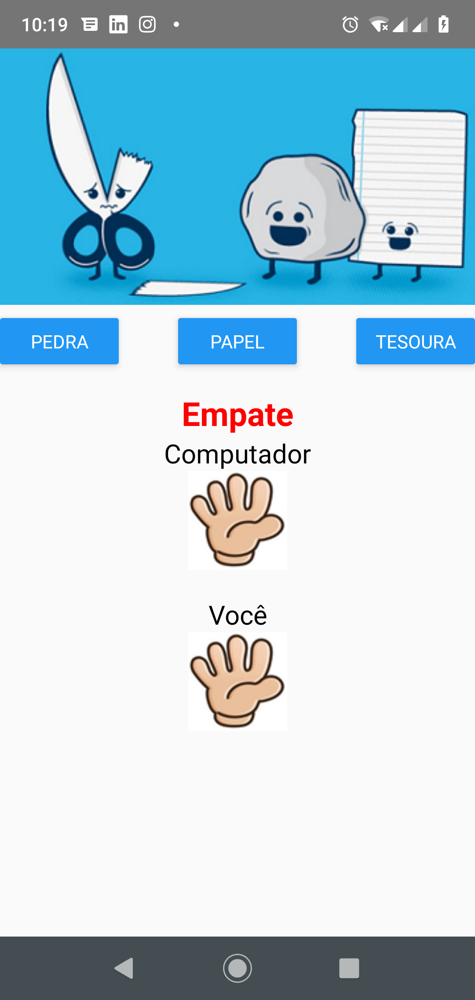

## APP4 Catálogo de produtos:

Aqui você aprenderá a utilizar o cliente HTTP Axios para realizar requisições HTTP e recuperar dados de um servidor externo, um excelente passo para criar aplicações capazes de consumir dados de APIs Rest.

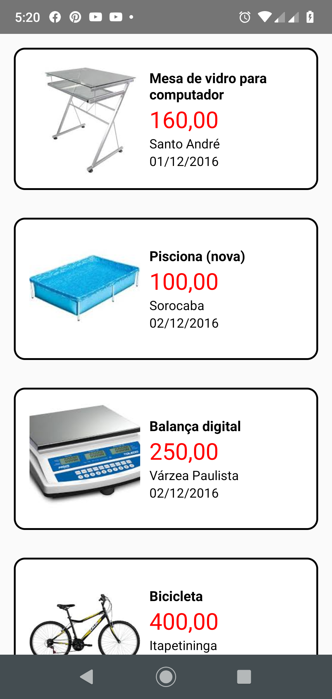
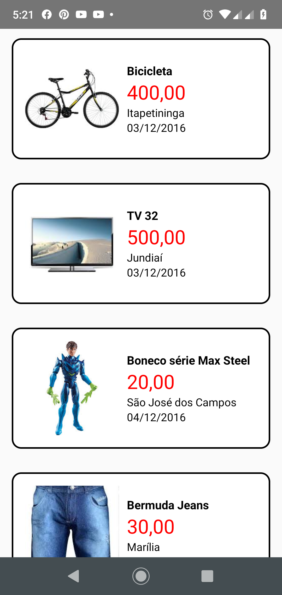

## APP5 ATM Consultoria:

Vamos aprender a como podemos implementar a navegação entre cenas dentro dos nossos Apps.

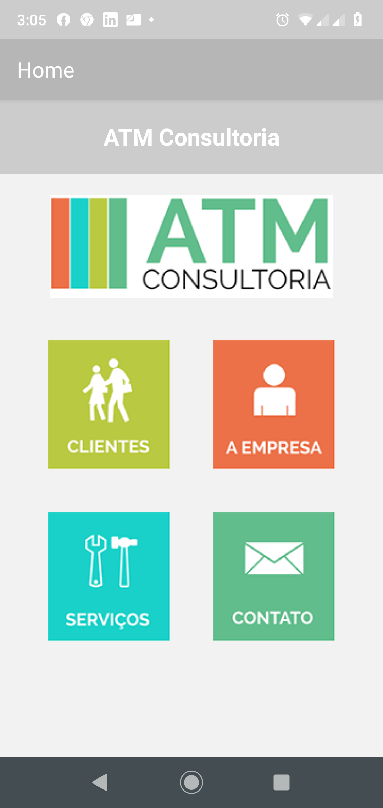
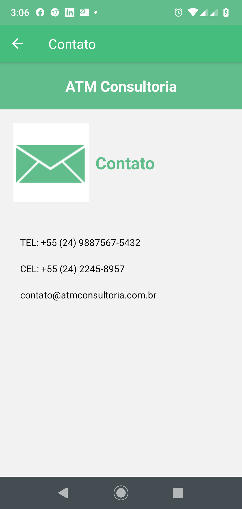
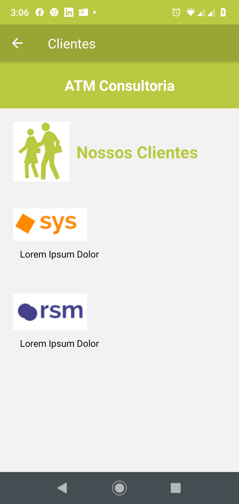
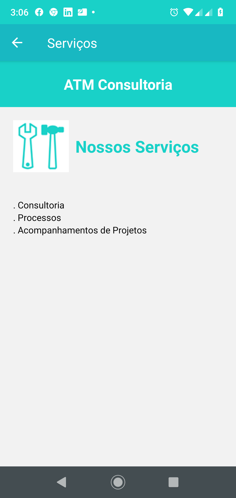
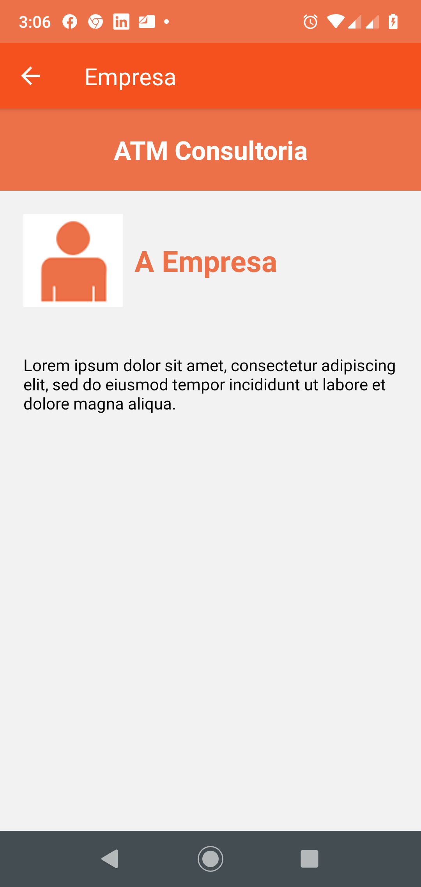

## APP6 Game Cara ou Coroa:

Nesse App vamos fazer uma super revisão do conteúdo. Além disso iremos aprender a como utilizar o React Native Router Flux para otimizar a navegação entre cenas dentro dos nossos Apps.

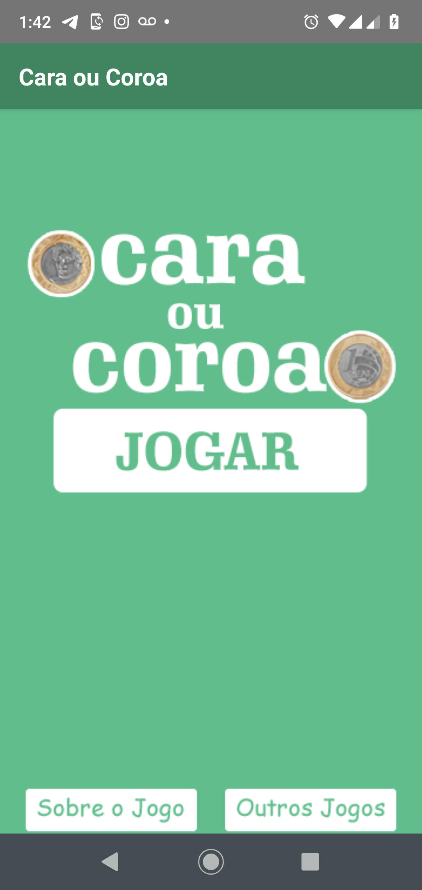
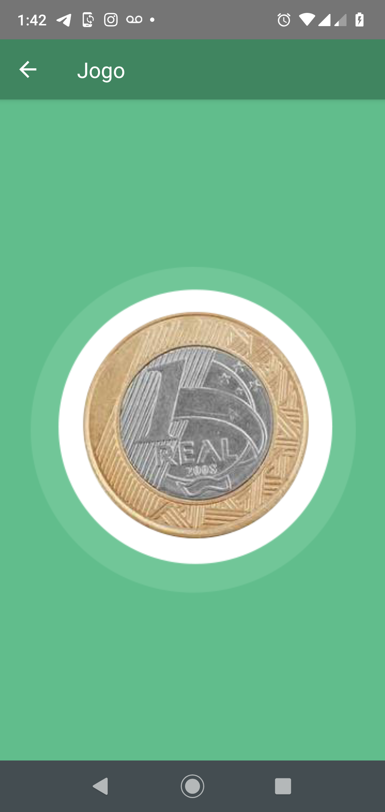
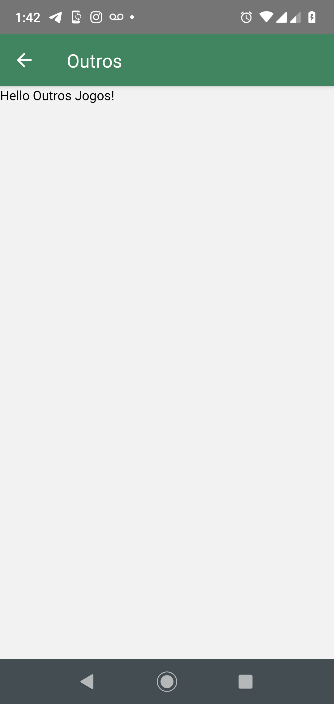
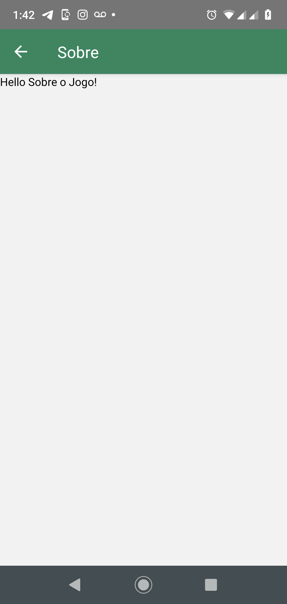

## APP7 Calculadora:

Chegou a hora de nos aprofundarmos ainda mais na essência do React. No nosso sétimo App vamos aprender sobre o Virtual DOM e sobre o contexto léxico de execução de funções JavaScript.

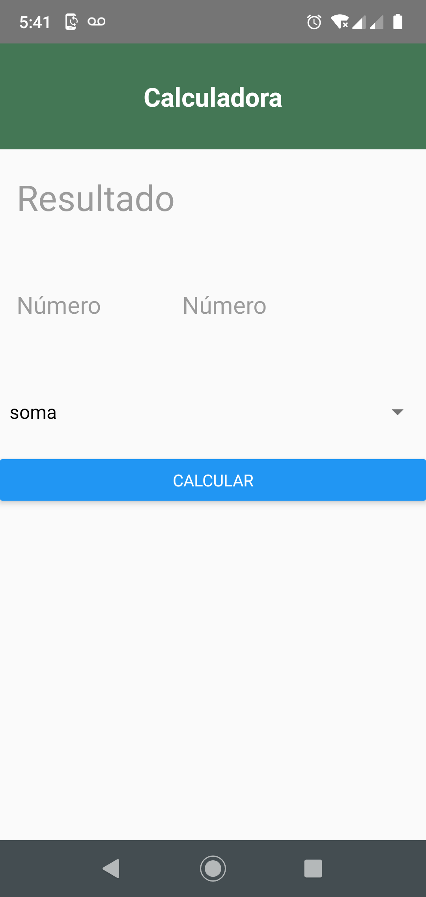

# Firebase 

## Configurar, salvar, atualizar, recuperar e remover dados:
Criar projeto na pasta raiz react-native init configFirebase
(coloque qualquer nome, mas que seja diferente de apenas Firebase).

Instale npm i firebase :fire:

Crie uma conta no Firebase
Escolher Web App
Ir em Settings -> Geral -> Configuração (Copiar Código na Função do Projeto)
Ir em Database -> Trocar para Realtime Database -> regras (Trocar para True para liberar a permissão)
Toda implementação do código vai aparecer em Database na aba de Dados.

## APP8 WhatsApp Clone:

Em nosso oitavo App vamos colocar todos os nossos conhecimentos em prática criando um App baseado no WhatsApp. O App será repleto de funcionalidades como o cadastro de usuários, autenticação (login), cadastro de contatos e troca de mensagens em tempo real.
